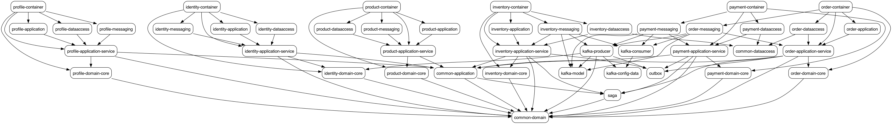

# 🛒 Ecommerce Microservices System

This is a backend project for an ecommerce platform designed using **microservices architecture**. The system is built to be **modular**, **scalable**, and **event-driven**, applying key architectural patterns such as:

- ✅ **Microservices** – to decompose the application into smaller, manageable services.
- ✅ **Event-Driven Architecture** – to enable asynchronous communication between services.
- ✅ **Domain-Driven Design (DDD)** – to model the business domain effectively.
- ✅ **Saga Pattern** – to manage distributed transactions across services.
- ✅ **Outbox Pattern** – to ensure reliable event delivery.
- ✅ **CQRS (Command Query Responsibility Segregation)** – to optimize for scalability and performance.
- ✅ **Clean and Hexagonal Architecture** – to maintain separation of concerns and testability.
- ✅ **Database per Service** – to ensure data ownership and independence.
- ✅ **Kafka** – to facilitate asynchronous communication between services.

This project consists of multiple backend APIs responsible for managing product information, user data, and inventory. The core focus is on the order placement flow, as it represents a complex, cross-service use case that involves coordination across multiple microservices.

---

## 💡 Motivation

The motivation behind this project stems from my desire to gain practical experience in designing distributed systems that are not only functional, but also scalable, resilient, and aligned with real-world architectural principles. Rather than stopping at theoretical knowledge, I wanted to build a system that forces me to solve problems commonly encountered in production — such as service coordination, data consistency, and domain complexity.

A central goal of this project is to internalize and apply **Domain-Driven Design (DDD)**. DDD provides a powerful way to break down a complex business problem into meaningful components that reflect the reality of the domain. In this project, I structured services around bounded contexts, defined aggregates carefully to maintain transactional boundaries, and used value objects and entities to model real business behavior. More importantly, DDD encouraged clear communication between code and business logic — allowing the technical design to evolve naturally from the problem space.

To manage the complexity of cross-service transactions, I applied the **Saga Pattern**, particularly using the choreography approach. Instead of relying on a central coordinator, services communicate via domain events to react and proceed in the transaction chain. This allows each service to stay autonomous while still participating in a long-running business process, such as placing an order. The compensation logic ensures that partial failures are gracefully handled, which is essential in a distributed environment.

In support of reliable event-driven communication, I implemented the **Outbox Pattern**. This pattern solves the common problem of atomicity between database writes and message publishing. By first storing domain events in a local outbox table within the same database transaction, and then asynchronously publishing them to Kafka, the system avoids inconsistencies between state and side effects — a crucial requirement for maintaining integrity across microservices.

Overall, this project is more than just an academic exercise. It’s a focused effort to deeply understand and apply modern backend engineering principles in a practical, hands-on way. Through it, I’ve learned to design better systems, think more clearly about architectural trade-offs, and prepare myself to handle the challenges of building reliable, maintainable software at scale.

---

## 🏗️ System Overview

The platform is composed of the following services:

| Service              | Responsibility                                |
|----------------------|-----------------------------------------------|
| **IdentityService**  | Manages user registration and authentication  |
| **ProfileService**   | Manages user profiles and preferences         |
| **ProductService**   | Handles product catalog and product info      |
| **InventoryService** | Manages stock levels and reservations         |
| **OrderService**     | Handles order creation and orchestration      |
| **PaymentService**   | Simulates payment gateway interaction         |

Other components

| Component       | Responsibility                                                    |
|-----------------|-------------------------------------------------------------------|
| **Api gateway** | Handles incoming requests and routes them to appropriate services |
| **Kafka**       | Message broker for asynchronous communication between services    |

All services communicate asynchronously using **Apache Kafka**, and each service manages its own database (**Database per Service** pattern).

### Run the following command to generate the dependency graph:

```bash
 mvn com.github.ferstl:depgraph-maven-plugin:aggregate -DcreateImage=true -DreduceEdges=false -Dscope=compile "-Dincludes=com.tuber*:*"
```


---

## 🎯 Nonfunctional Requirements

The system must meet the following nonfunctional requirements to ensure high performance, maintainability, and reliability:

- **Scalability**: The architecture must support horizontal scaling to handle increased load during peak usage.
- **Availability**: The system should maintain a high availability rate using redundancy and fault-tolerant services.
- **Resilience**: One failure should not cascade to other services. Each service should be able to recover independently.
- **Performance**: The apis should be fast and responsive, with low latency and high throughput.
- **Maintainability**: The codebase must follow clean architecture principles and be modular to enable easy updates and testing.
- **Consistency**: Eventual consistency should be ensured across microservices through asynchronous communication patterns (e.g., Kafka + Outbox pattern).
- **Message Driven**: The system should be designed to handle asynchronous events and messages, allowing for decoupled communication between services.

---

## ✅ Functional Requirements

The application is expected to support the following core functionalities:

- User registration, login, and authentication.
- Managing user profiles including view, update, and deactivate.
- Product listing with detailed information and availability.
- Inventory tracking and adjustment on order placement or cancellation.
- Placing, viewing, and cancelling customer orders.
- Payment processing and status tracking.
- Order status updates and state transitions.
- Admin interfaces for product, inventory, and order management.

---

## 🚀 Features

This system includes a rich set of features to deliver a seamless e-commerce experience:

- ✅ **User Management**: Secure registration, authentication (OAuth2), and profile updates.
- 📦 **Product Catalog**: Manage products static information.
- 🛒 **Order Processing**: Support placing orders.
- 💳 **Payments Integration**: Seamless simulated payment integration and status tracking.
- 📉 **Inventory Management**: Automatic stock deduction and validation during order placement, manage export and import goods.
- 📬 **Asynchronous Messaging**: Kafka-based event communication between services (saga pattern).
- 🧾 **Outbox**: Reliable messaging with Outbox pattern for consistency across services.
- 🔐 **Role-based Access Control (RBAC)**: Protect sensitive operations with role permissions.

---

## 🏗️ Architecture Overview


---

## 🔄 Order State Transition

---

## 📁 Folder Structure

---

## 🛒 Order Placement Flow (Using Saga Pattern)

This flow demonstrates how the system coordinates a distributed transaction across multiple services when a user places an order.

### 1. `OrderService` (Command Side - CQRS)
- Receives a REST API request to create an order.
- Saves the order in `PENDING` state.
- Writes an `OrderCreated` event into the outbox table.
- A background worker reads the outbox and publishes the event to Kafka.

### 2. `InventoryService`
- Listens to `OrderCreated` events.
- Checks stock availability:
   - If sufficient: reserves items and emits `InventoryReserved`.
   - If not: emits `InventoryReservationFailed`.

### 3. `PaymentService`
- Listens to `InventoryReserved`.
- Simulates payment processing:
   - On success: emits `PaymentCompleted`.
   - On failure: emits `PaymentFailed`.

### 4. `OrderService`
- Listens to final outcome events:
   - If `PaymentCompleted`: updates order status to `COMPLETED`.
   - If `InventoryReservationFailed` or `PaymentFailed`: marks order as `CANCELLED`.

### 5. Compensation Logic (Saga rollback)
- On failure, a `OrderCancelled` event is emitted.
- `InventoryService` listens to this and releases previously reserved stock.

---

## 📋 Prerequisites
- [Java 21](https://www.oracle.com/technetwork/pt/java/javase/downloads/index.html)
- [Maven 3.9.x+](https://maven.apache.org/download.cgi)
- [MySQL](https://www.mysql.com/)
- [Apache Kafka](https://kafka.apache.org/)
- Docker
- Docker-Compose
- [Rancher Desktop](https://rancherdesktop.io/) or [Docker Desktop](https://www.docker.com/products/docker-desktop/) for Windows platform (optional)
- [Postman](https://www.postman.com/) (optional)

---

## 🧩 Dependencies

This project leverages a variety of essential libraries and frameworks to support robust, scalable, and maintainable development across its microservices architecture.

### Core Dependencies

- **Spring Boot Starter Web**  
  Enables the development of RESTful web applications. It simplifies the configuration and setup of web servers and API routing.

- **Spring Boot Starter Validation**  
  Provides support for bean validation using Hibernate Validator. Useful for validating incoming requests and ensuring data integrity.

- **Spring Boot Starter Data JPA**  
  Simplifies data access with the Java Persistence API (JPA), especially when working with databases such as PostgreSQL.

- **Spring TX**  
  Provides programmatic and declarative transaction management for Spring-based applications.

- **Spring Kafka**  
  Integrates the Apache Kafka messaging system with Spring applications, enabling event-driven architecture and asynchronous communication.

- **Kafka Avro Serializer**  
  Used for serializing and deserializing Kafka messages using Avro schemas, ensuring message format consistency and schema evolution.

### Logging and Monitoring

- **Spring Boot Starter Logging (Logback)**  
  Provides default logging support using Logback. Central to debugging, monitoring, and tracing across services.

- **Log4J (Optional/Additional)**  
  Can be integrated for advanced logging configurations, especially in larger or legacy systems.

### Developer Productivity

- **Lombok**  
  Reduces boilerplate code by generating getters, setters, constructors, and more at compile time. Improves code readability and maintainability.

- **MapStruct**  
  A code generator that greatly simplifies the implementation of mappings between Java bean types.

- **Spring Boot DevTools**  
  Improves developer experience with features like automatic restarts, live reload, and configurations for development-only environments.

### Cloud-Native Support

- **Spring Cloud OpenFeign**  
  Declarative REST client that simplifies HTTP client creation for inter-service communication in a microservices environment.

- **Spring Cloud Dependencies**  
  Provides a consistent version set of Spring Cloud projects, including Config, Eureka, Gateway, and more.

### Serialization

- **Jackson Databind**  
  Core library for converting Java objects to JSON and vice versa.

- **Jackson Databind Nullable**  
  Adds support for handling nullable JSON properties in a more explicit and type-safe way.

### Testing

- **Mockito**  
  A popular framework used for creating mock objects in unit tests, supporting test-driven development (TDD).


Each module within the monorepo (e.g., `identity-service`, `profile-service`, `order-service`, etc.) also defines internal dependencies (e.g., `*-application`, `*-domain-core`, `*-messaging`) following a Domain-Driven Design (DDD) approach to enforce clear separation of concerns.

---

## 🚀 Getting Started

```bash
# Clone the repository
git clone https://github.com/your-username/ecommerce-microservices.git
cd ecommerce-microservices

# Start all services
docker-compose up --build
``` 
---
## 📬 API Documentation
